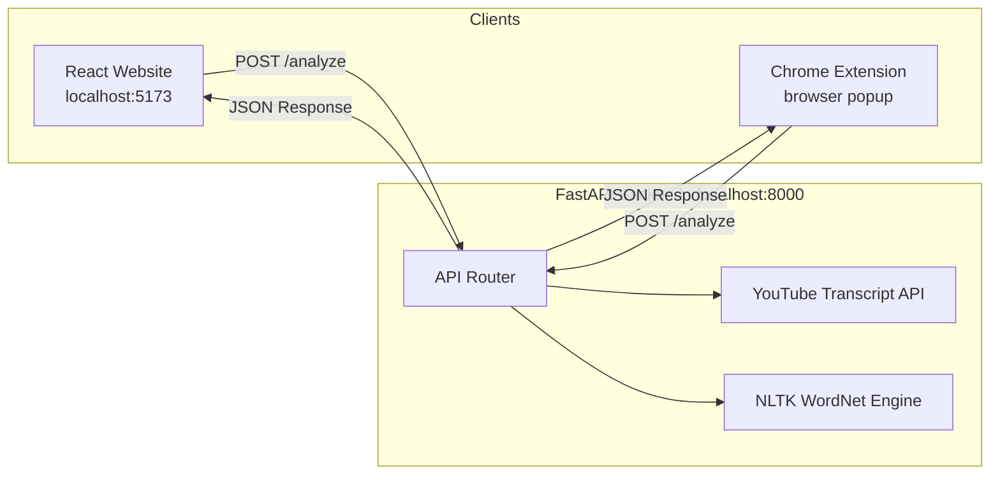

# LectureFind — Intelligent YouTube Lecture Navigator

> Search for any concept inside a YouTube lecture and jump straight to where it's discussed.

LectureFind is a tool (website + Chrome extension) that lets you search for specific topics within YouTube lecture videos. Instead of scrubbing through an hour-long recording, you type a concept like "gradient descent" and the system returns the exact time ranges where that topic is covered — complete with NLP-powered synonym expansion and temporal clustering.

---

## Table of Contents

- [How the Project Works](#how-the-project-works)
  - [Architecture Overview](#architecture-overview)
  - [Step-by-Step Flow](#step-by-step-flow)
  - [NLP Pipeline Details](#nlp-pipeline-details)
- [Tech Stack](#tech-stack)
- [Project Structure](#project-structure)
- [Prerequisites](#prerequisites)
- [Installation & Setup](#installation--setup)
  - [1. Clone the Repository](#1-clone-the-repository)
  - [2. Backend Setup (Python / FastAPI)](#2-backend-setup-python--fastapi)
  - [3. Frontend Setup (React / Vite)](#3-frontend-setup-react--vite)
  - [4. Chrome Extension Setup](#4-chrome-extension-setup)
- [Usage](#usage)
  - [Using the Website](#using-the-website)
  - [Using the Chrome Extension](#using-the-chrome-extension)
- [API Reference](#api-reference)
- [Configuration & Tuning](#configuration--tuning)
- [Troubleshooting](#troubleshooting)
- [Contributing](#contributing)
- [License](#license)

---

## How the Project Works

### Architecture Overview

The project has three components that work together:



- **Frontend (React + Vite):** The web interface where users paste a YouTube URL and a concept. Results are displayed as time-range cards with "Go to Clip" buttons.
- **Backend (FastAPI + Python):** Handles all the heavy lifting — fetching transcripts, expanding keywords through NLP, searching the transcript, clustering matches, and computing similar topic suggestions.
- **Chrome Extension:** A lightweight browser popup that reads the URL of the currently open YouTube tab, sends the query to the same backend, and can jump the video player to the matched timestamp directly.

### Step-by-Step Flow

1. **User submits a query** — a YouTube URL and a concept keyword (e.g. "backpropagation").
2. **Backend extracts the video ID** from the URL and fetches the full transcript using the `youtube-transcript-api` library.
3. **NLP keyword expansion** — the concept is run through NLTK's WordNet to find all synonyms and semantically related terms. For example, "learning" might expand to include "acquisition", "scholarship", "eruditeness", etc.
4. **Transcript search** — every line of the transcript is checked against the expanded keyword list (case-insensitive substring matching).
5. **Temporal clustering** — instead of returning 30 individual timestamps, consecutive matches within a 45-second window are merged into time ranges (e.g. "2:30 – 3:15").
6. **Similar topic fallback** — if zero matches are found, the system extracts the most frequent meaningful words from the transcript, computes their Wu-Palmer semantic similarity to the user's query using WordNet, and returns the top 5 closest topics that actually appear in the video.
7. **Response** — the backend returns JSON with the clustered results, expanded keywords, and (if applicable) suggested topics.
8. **Frontend renders** the results as cards. Each card shows the time range, the merged transcript text with highlighted matches, and a "Go to Clip" button that opens YouTube at that timestamp.

### NLP Pipeline Details

The NLP processing uses two key techniques:

**Synonym Expansion (WordNet)**
- The user's concept is looked up in NLTK's WordNet lexical database.
- All synsets (synonym sets) for the word are retrieved.
- Every lemma (word form) from every synset is added to the search terms.
- Multi-word concepts are split and each word is expanded individually.

**Semantic Similarity (Wu-Palmer)**
- When no matches are found, the system needs to suggest related topics.
- It extracts the 50 most frequent non-stopword terms from the transcript (minimum 4 characters).
- For each transcript keyword, it computes the maximum Wu-Palmer similarity score against all synsets of the user's query.
- Wu-Palmer similarity measures the depth of two concepts in the WordNet taxonomy — values closer to 1.0 indicate higher similarity.
- The top 5 keywords by similarity score are returned as suggestions.

---

## Tech Stack

| Component | Technology |
|-----------|-----------|
| Backend API | Python 3.10+, FastAPI, Uvicorn |
| NLP Engine | NLTK (WordNet, Stopwords) |
| Transcript Extraction | `youtube-transcript-api` |
| Frontend | React 19, Vite |
| Chrome Extension | Manifest V3, Vanilla JS |
| Styling | Vanilla CSS, DM Sans + Space Grotesk fonts |

---

## Project Structure

```
video_analyser/
├── backend/
│   ├── main.py               # FastAPI application — all endpoints and NLP logic
│   ├── requirements.txt      # Python dependencies
│   ├── setup_nltk.py         # One-time script to download NLTK data
│   └── nltk_data/            # (created after running setup_nltk.py)
│
├── frontend/
│   ├── index.html             # Vite entry HTML
│   ├── package.json           # Node dependencies
│   ├── vite.config.js         # Vite configuration
│   └── src/
│       ├── main.jsx           # React entry point
│       ├── App.jsx            # Main application component
│       ├── App.css            # All styles
│       └── index.css          # Global reset
│
├── extension/
│   ├── manifest.json          # Chrome extension manifest (V3)
│   ├── popup.html             # Extension popup UI
│   ├── popup.js               # Extension popup logic
│   └── content.js             # Content script — handles video timestamp jumping
│
└── README.md                  # This file
```

---

## Prerequisites

Before setting up the project, make sure you have the following installed:

| Tool | Minimum Version | Check Command |
|------|----------------|---------------|
| **Python** | 3.10 or higher | `python --version` |
| **pip** | Latest | `pip --version` |
| **Node.js** | 18 or higher | `node --version` |
| **npm** | 9 or higher | `npm --version` |
| **Google Chrome** | Latest | (for the extension) |

---

## Installation & Setup

### 1. Clone the Repository

```bash
git clone https://github.com/your-username/video_analyser.git
cd video_analyser
```

Or if you have the project as a zip file, extract it and open a terminal in the `video_analyser` folder.

### 2. Backend Setup (Python / FastAPI)

Open a terminal and navigate to the backend folder:

```bash
cd backend
```

**(a) Install Python dependencies:**

```bash
pip install -r requirements.txt
```

This installs:
- `fastapi` — the web framework
- `uvicorn` — ASGI server to run FastAPI
- `youtube-transcript-api` — fetches YouTube subtitles/transcripts
- `nltk` — Natural Language Toolkit for synonym expansion
- `pydantic` — data validation (used by FastAPI)

**(b) Download NLTK language data:**

```bash
python setup_nltk.py
```

This downloads three NLTK datasets into a local `nltk_data/` folder:
- `wordnet` — the lexical database used for synonym lookup
- `omw-1.4` — Open Multilingual WordNet
- `stopwords` — common English words to filter out (the, is, at, etc.)

You only need to run this once.

**(c) Start the backend server:**

```bash
uvicorn main:app --reload --port 8000
```

You should see output like:
```
INFO:     Uvicorn running on http://127.0.0.1:8000
INFO:     Started reloader process
```

The `--reload` flag means the server will automatically restart when you edit `main.py`.

**Verify it works:** Open http://localhost:8000 in your browser. You should see:
```json
{"message": "NLP YouTube Lecture Navigator API is running"}
```

> **Keep this terminal open.** The backend must be running for both the website and the extension to work.

### 3. Frontend Setup (React / Vite)

Open a **new/second terminal** and navigate to the frontend folder:

```bash
cd frontend
```

**(a) Install Node.js dependencies:**

```bash
npm install
```

**(b) Start the development server:**

```bash
npm run dev
```

You should see:
```
VITE ready in 500ms

➜  Local:   http://localhost:5173/
```

**Open http://localhost:5173 in your browser** to use the website.

### 4. Chrome Extension Setup

The Chrome extension does **not** need to be built — it's plain HTML/CSS/JS that Chrome loads directly.

Follow these steps:

1. Open **Google Chrome**.
2. Type `chrome://extensions` in the address bar and press Enter.
3. Enable **Developer mode** using the toggle in the top-right corner.
4. Click the **"Load unpacked"** button in the top-left.
5. In the file picker, navigate to the `video_analyser/extension/` folder and select it.
6. The extension "LectureFind — Concept Navigator" will appear in your extensions list.
7. **(Optional)** Click the puzzle-piece icon (Extensions) in Chrome's toolbar and pin "LectureFind" for easy access.

> **Important:** The backend server (step 2c) must be running on `localhost:8000` for the extension to work.

---

## Usage

### Using the Website

1. Make sure the backend is running (`uvicorn main:app --reload --port 8000`).
2. Open http://localhost:5173 in your browser.
3. Paste a YouTube video URL into the first input field.
   - Example: `https://www.youtube.com/watch?v=aircAruvnKk`
4. Type a concept into the second field.
   - Example: `neuron` or `activation function`
5. Click **"Search Video"** (or press Enter).
6. Results appear as cards showing:
   - **Time range** (e.g. 1:24 – 2:10) — the clustered segment where the topic is discussed
   - **Transcript excerpt** — with matched terms highlighted in yellow
   - **"Go to Clip" button** — opens YouTube at that exact timestamp in a new tab
7. If no results are found, the system shows **suggested related topics** as clickable chips. Click any chip to search for that term instead.

### Using the Chrome Extension

1. Make sure the backend is running.
2. Open any YouTube video in Chrome (e.g. `https://www.youtube.com/watch?v=aircAruvnKk`).
3. Click the LectureFind extension icon in Chrome's toolbar.
4. Type your concept in the search field and press Enter or click "Search in Video".
5. Results appear in the popup as clip cards.
6. Click **"▶ Go to Clip"** — the YouTube player on the current page will **jump directly to that timestamp** and start playing. No new tab is opened.

---

## API Reference

The backend exposes one main endpoint:

### `POST /analyze`

**Request body (JSON):**
```json
{
  "video_url": "https://www.youtube.com/watch?v=aircAruvnKk",
  "concept": "neuron"
}
```

**Response (JSON):**
```json
{
  "video_id": "aircAruvnKk",
  "original_concept": "neuron",
  "expanded_concepts": ["neuron", "nerve cell"],
  "results": [
    {
      "timestamp": 84.0,
      "formatted_time": "1:24 - 2:10",
      "text": "Each neuron in the first layer corresponds to one of the 784 pixels...",
      "matched_concepts": ["neuron"]
    }
  ],
  "suggested_topics": []
}
```

| Field | Description |
|-------|-------------|
| `video_id` | Extracted YouTube video ID |
| `original_concept` | The original search term |
| `expanded_concepts` | All terms searched (original + NLP synonyms) |
| `results` | Array of clustered time segments with matches |
| `suggested_topics` | Only populated when `results` is empty — the top 5 semantically similar topics in the video |

### `GET /`

Health check. Returns `{"message": "NLP YouTube Lecture Navigator API is running"}`.

---

## Configuration & Tuning

You can adjust these values in `backend/main.py`:

| Parameter | Default | Description |
|-----------|---------|-------------|
| `CLUSTER_THRESHOLD` | `45.0` (seconds) | Maximum gap between two matches before they're split into separate clusters. Increase for broader grouping. |
| Top N similar topics | `5` | Number of fallback topic suggestions when no match is found. Change in `get_similar_topics()` return slice. |
| Top N keywords | `50` | Number of transcript keywords evaluated for similarity. Change in `extract_frequent_keywords()`. |

---

## Troubleshooting

### "Could not retrieve transcript"
- The video may not have subtitles/captions enabled.
- Try a different video — most popular educational videos have auto-generated English subtitles.
- Your IP might be rate-limited by YouTube. Wait a few minutes and try again.

### "Cannot reach the backend on localhost:8000"
- Make sure you ran `uvicorn main:app --reload --port 8000` and the terminal is still open.
- Check that no other application is using port 8000.

### Extension says "Open a YouTube video first"
- The extension only works on pages matching `youtube.com/watch*`. Make sure you're on a video page, not the YouTube homepage.

### Search returns no results
- This is expected if the topic genuinely isn't discussed in the video. Try the suggested related topics.
- The transcript search is substring-based. Very short keywords (1-2 characters) are skipped.
- Multi-word concepts are searched as a phrase. Try individual words if the phrase doesn't match.

### NLTK download errors
- If `setup_nltk.py` fails due to SSL errors, the script already attempts to bypass certificate verification. If it still fails, try downloading the data manually:
  ```bash
  python -c "import nltk; nltk.download('wordnet'); nltk.download('omw-1.4'); nltk.download('stopwords')"
  ```

### Extension not appearing in Chrome
- Make sure you selected the `extension/` folder (not the project root) when loading unpacked.
- Check for errors on `chrome://extensions` — the extension card will show a red "Errors" button if something is wrong.

